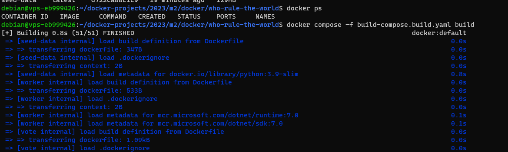
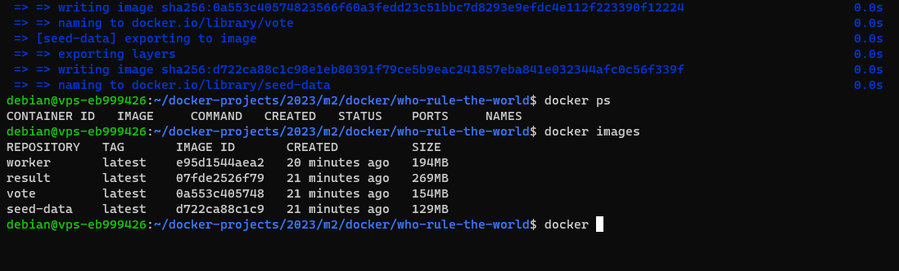
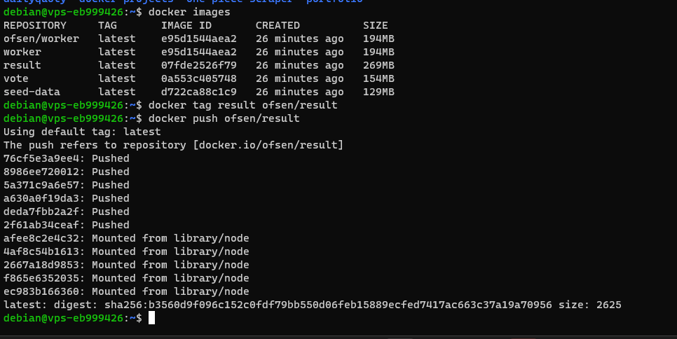
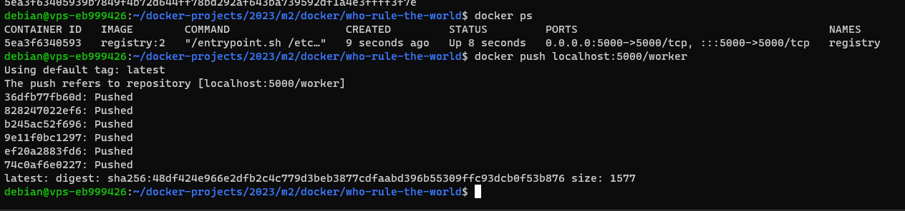
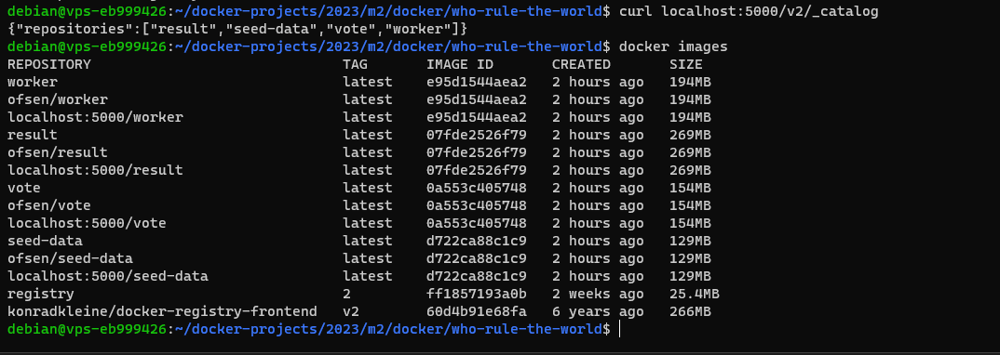
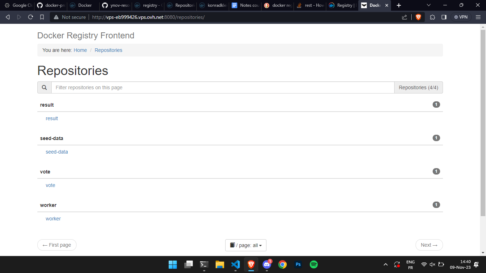
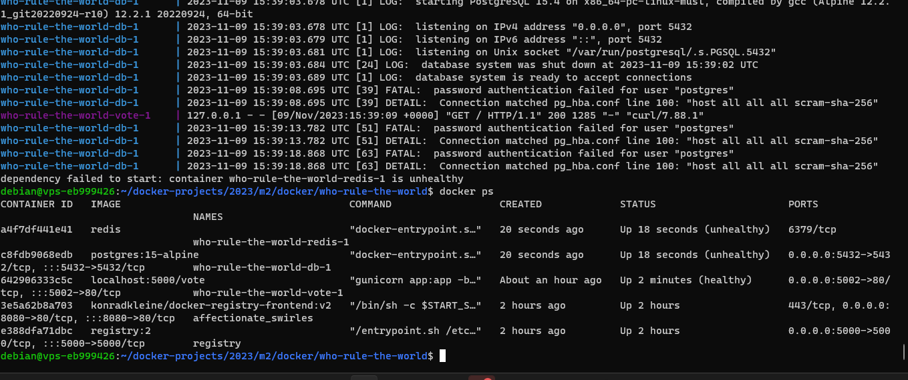

# Submission Docker Final Evaluation - WhoRulesTheWorld

This is the submission of the final evaluation for the Docker module named: "WhoRulesTheWorld"

### Participents

- Yanis OUERDANE
- Salim AYACHE
- Abdelghani LARABI

# Table of Contents

- [Submission Docker Final Evaluation - WhoRulesTheWorld](#submission-docker-final-evaluation---whorulestheworld)
  - [Participents](#participents)
- [Summary](#summary)
- [Architecture](#architecture)
  - [Front-end for votes](#front-end-for-votes)
  - [Redis DB](#redis-db)
  - [Worker](#worker)
  - [Postgres DB](#postgres-db)
  - [Front-end for results](#front-end-for-results)
- [Steps](#steps)
  - [1 - Create the Dockerfile for the front-end for votes](#1---create-the-dockerfile-for-the-front-end-for-votes)
  - [2 - Create the Dockerfile for the worker](#2---create-the-dockerfile-for-the-worker)
  - [3 - Create the Dockerfile for the front-end for results](#3---create-the-dockerfile-for-the-front-end-for-results)
  - [4 - Create the Dockerfile for seed-data](#4---create-the-dockerfile-for-seed-data)
  - [5 - Create the docker-compose.build.yaml file](#5---create-the-docker-composebuildyaml-file)
  - [6 - Create the compose.yaml file](#6---create-the-composeyaml-file)
- [Building the images](#building-the-images)
- [Pushing the images publically & locally](#pushing-the-images-publically--locally)
- [Running the application](#running-the-application)

# Summary

The goal of the evaluation is to orchestrat an architecture using Docker and Docker-compose.

The architecture is composed of 4 services: front-end for votes, redis DB, a worker in .NET, postres DB & front-end for results

# Architecture


## Front-end for votes

The front-end for votes is a simple web application that allows users to vote for either cats or dogs. The application is written in Python. The application is available on port 5002.

## Redis DB

The Redis DB is used to store the votes. The Redis DB is available on port 6379.

## Worker

The worker is a .NET application that reads the votes from the Redis DB and stores them in the Postgres DB.

## Postgres DB

The Postgres DB is used to store the votes. The Postgres DB is available on port 5432.

## Front-end for results

The front-end for results is a simple web application that displays the results. The application is written in Python. The application is available on port 5001.

# Steps

## 1 - Create the Dockerfile for the front-end for votes

```dockerfile
# Define a base stage that uses the official python runtime base image
FROM python:3.11-slim AS base

# Add curl for healthcheck
RUN apt-get update && \
    apt-get install -y --no-install-recommends curl && \
    rm -rf /var/lib/apt/lists/*

# Set the application directory
WORKDIR /usr/local/app

# Install our requirements.txt
COPY requirements.txt ./requirements.txt
RUN pip install --no-cache-dir -r requirements.txt

# Define a stage specifically for development, where it'll watch for
# filesystem changes
FROM base AS dev
RUN pip install watchdog
ENV FLASK_ENV=development
CMD ["python", "app.py"]

# Define the final stage that will bundle the application for production
FROM base AS final

# Copy our code from the current folder to the working directory inside the container
COPY . .

# Make port 80 available for links and/or publish
EXPOSE 80

# Define our command to be run when launching the container
CMD ["gunicorn", "app:app", "-b", "0.0.0.0:80", "--log-file", "-", "--access-logfile", "-", "--workers", "4", "--keep-alive", "0"]
```

## 2 - Create the Dockerfile for the worker

```dockerfile
FROM --platform=${BUILDPLATFORM} mcr.microsoft.com/dotnet/sdk:7.0 as build
ARG TARGETPLATFORM
ARG TARGETARCH
ARG BUILDPLATFORM
RUN echo "I am running on $BUILDPLATFORM, building for $TARGETPLATFORM"

WORKDIR /source
COPY *.csproj .
RUN dotnet restore -a $TARGETARCH

COPY . .
RUN dotnet publish -c release -o /app -a $TARGETARCH --self-contained false --no-restore

# app image
FROM mcr.microsoft.com/dotnet/runtime:7.0
WORKDIR /app
COPY --from=build /app .
ENTRYPOINT ["dotnet", "Worker.dll"]
```

## 3 - Create the Dockerfile for the front-end for results

```dockerfile
FROM node:18-slim

# add curl for healthcheck
RUN apt-get update && \
    apt-get install -y --no-install-recommends curl tini && \
    rm -rf /var/lib/apt/lists/*

WORKDIR /usr/local/app

# have nodemon available for local dev use (file watching)
RUN npm install -g nodemon

COPY package*.json ./

RUN npm ci && \
 npm cache clean --force && \
 mv /usr/local/app/node_modules /node_modules

COPY . .

ENV PORT 80
EXPOSE 80

ENTRYPOINT ["/usr/bin/tini", "--"]
CMD ["node", "server.js"]
```

## 4 - Create the Dockerfile for seed-data

```dockerfile
FROM python:3.9-slim

# add apache bench (ab) tool
RUN apt-get update \
    && apt-get install -y --no-install-recommends \
    apache2-utils \
    && rm -rf /var/lib/apt/lists/*

WORKDIR /seed

COPY . .

# create POST data files with ab friendly formats
RUN python make-data.py

CMD /seed/generate-votes.sh
```

## 5 - Create the docker-compose.build.yaml file

```yaml
version: "3"
services:
  worker:
    image: worker
    build: ./worker

  vote:
    image: vote
    build: ./vote

  seed-data:
    image: seed-data
    build: ./seed-data

  result:
    image: result
    build: ./result
```

## 6 - Create the compose.yaml file

```yaml
version: "3"
services:
  worker:
    image: localhost:5000/worker
    depends_on:
      redis:
        condition: service_healthy
      db:
        condition: service_healthy
    networks:
      - back-tier

  vote:
    image: localhost:5000/vote
    volumes:
      - ./vote:/usr/local/app
    ports:
      - 5002:80
    networks:
      - back-tier
      - front-tier
    healthcheck:
      test: ["CMD", "curl", "-f", "http://localhost"]
      interval: 15s
      timeout: 5s
      retries: 3
      start_period: 10s

  seed-data:
    image: localhost:5000/seed-data
    profiles: ["seed"]
    depends_on:
      vote:
        condition: service_healthy
    restart: "no"
    networks:
      - front-tier

  result:
    image: localhost:5000/result
    entrypoint: nodemon --inspect=0.0.0.0 server.js
    depends_on:
      db:
        condition: service_healthy
    volumes:
      - ./result:/usr/local/app
    ports:
      - "5001:80"
      - "127.0.0.1:9229:9229"

  db:
    image: postgres:15-alpine
    networks:
      - back-tier
    volumes:
      - "db-data:/var/lib/postgresql/data"
      - "./healthchecks:/healthchecks"
    healthcheck:
      test: /healthchecks/postgres.sh
      interval: "5s"
    environment:
      POSTGRES_PASSWORD: "postgres"
      POSTGRES_USER: "postgres"
      POSTGRES_DB: "postgres"
    ports:
      - 5432:5432

  redis:
    image: redis
    volumes:
      - "./healthchecks:/healthchecks"
    networks:
      - back-tier
    healthcheck:
      test: /healthchecks/redis.sh
      interval: "5s"

networks:
  back-tier:
  front-tier:

volumes:
  db-data:
```

# Building the images

Using the `build-compose.build.yaml` to build the images



# Pushing the images publically & locally

Use the `docker tag <image> <registry>/<image>` to tag the image with the registry name & push the images appropriatly





# Running the application

Using the `compose.yaml` file to build the containers & run the application


